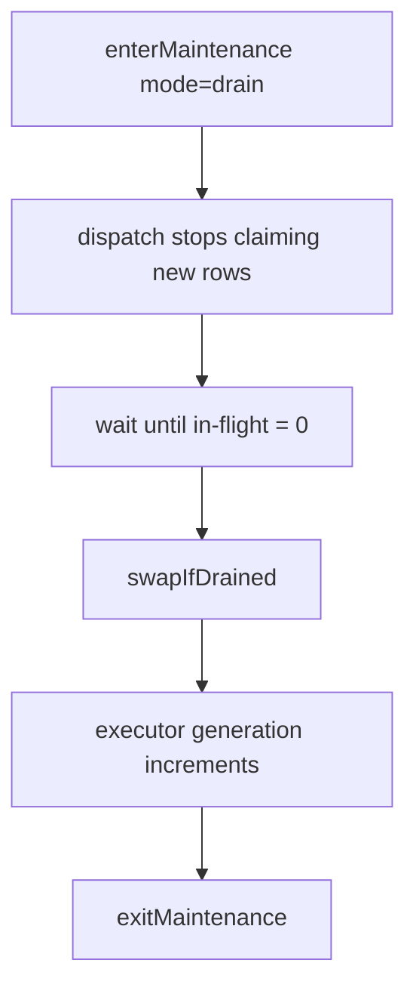

# Admin API

Module: `exchange.workflows.api.admin`

This API is for maintenance operations and safe runtime cutovers.

## Functions

- `checkSchema(dbName=None)`
- `applyRetention(dbName=None)`
- `enterMaintenance(mode="drain"|"cancel", reason="", queueName=None, dbName=None)`
- `exitMaintenance(dbName=None)`
- `getMaintenanceStatus(dbName=None)`
- `swapIfDrained(dbName=None)`

## Maintenance strategy

Use maintenance when deploying new workflow code and you want predictable version behavior.



## Drain-mode deployment runbook

```python
import exchange.workflows.api.admin as admin

print admin.enterMaintenance(mode="drain", reason="deploying workflows")

status = admin.getMaintenanceStatus()
print status

# Wait for inFlightWorkflows/activeWorkflows to reach zero, then:
print admin.swapIfDrained()
print admin.exitMaintenance()
```

## Cancel-mode emergency runbook

Use this for emergency stops during incidents.

```python
print exchange.workflows.api.admin.enterMaintenance(
    mode="cancel",
    reason="incident: downstream system unstable",
)
```

This can cancel queued and running work cooperatively.

## Retention

Retention config lives in `workflows.retention_config` (`id = 1`).

- `time_threshold_hours`: delete old terminal history.
- `rows_threshold`: keep only newest N terminal runs.
- `global_timeout_hours`: cancel long-running active runs.

Apply manually:

```python
print exchange.workflows.api.admin.applyRetention()
```

Or schedule it from a timer script if needed.
