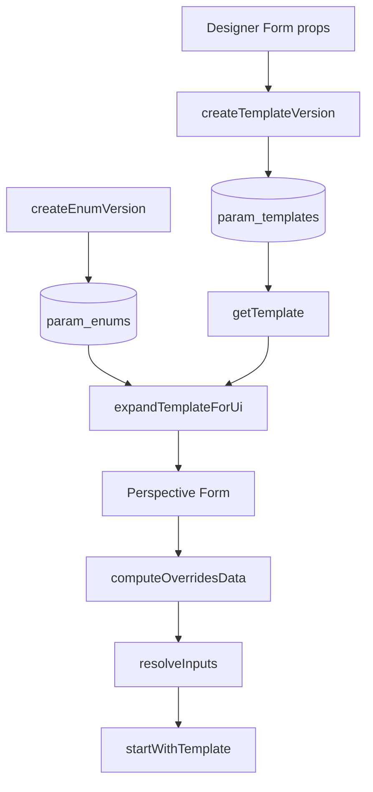

# Params API

Module: `exchange.workflows.api.params`

This API gives you versioned parameter templates and enums so operators can run workflows with structured input forms.

## Current scope

- Template versioning
- Enum versioning
- Template expansion for UI (enum options injected)
- Input resolution + start helper (`startWithTemplate`)

## Template storage

Template rows store `schema_json` like:

```json
{
  "formProps": {"...": "Perspective Form props"},
  "meta": {
    "paramKeys": ["duration_s", "mode"],
    "widgetTypes": {"duration_s": "number", "mode": "dropdown"},
    "defaultData": {"duration_s": 30, "mode": "AUTO"},
    "enumRefs": {"mode": {"enumName": "BatchMode", "enumVersion": null}}
  }
}
```

## Enum placeholder convention

For enum-capable widgets, store a placeholder in options:

- `label` or `text`: `@enum:BatchMode` or `@enum:BatchMode:2`
- `value`: `__enum__` (recommended)

At runtime, `expandTemplateForUi(...)` resolves DB enum values into widget options.

## Typical flow



## APIs

### Create template version

```python
formProps = {
    "name": "demo.commands_60s.default",
    "data": {"duration_s": 60, "mode": "AUTO"},
    "columns": {"items": []},
}

resp = exchange.workflows.api.params.createTemplateVersion(
    workflowName="demo.commands_60s",
    templateName="default",
    formProps=formProps,
    description="Default run template",
    createdBy="admin",
    activate=True,
)
print resp
```

### Create enum version

```python
enumValues = [
    {"label": "Auto", "value": "AUTO", "isDisabled": False},
    {"label": "Manual", "value": "MANUAL", "isDisabled": False},
]

resp = exchange.workflows.api.params.createEnumVersion(
    enumName="BatchMode",
    enumValues=enumValues,
    description="Batch mode selector",
)
print resp
```

### Resolve and start

```python
resp = exchange.workflows.api.params.startWithTemplate(
    workflowName="demo.commands_60s",
    templateName="default",
    overridesData={"duration_s": 90},
    templateVersion=None,
    actor="operator_1",
    queueName="default",
    partitionKey="line-1/reactor-a",
    timeoutSeconds=180,
)
print resp
```
