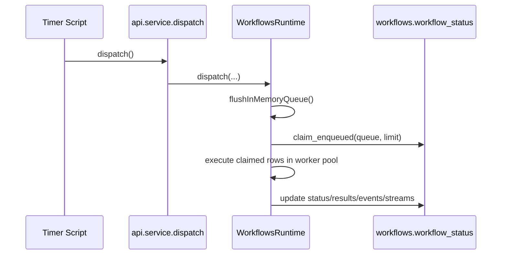

# Service API

Module: `exchange.workflows.api.service`

Use this from timer scripts, Perspective actions, and gateway scripts.

## Response format

All service calls return a consistent format:

```python
{
  "ok": True or False,
  "code": "WORKFLOW_ENQUEUED",
  "message": "Workflow enqueued.",
  "data": {...},
  "meta": {"tsMs": 0, "durationMs": 0, "dbName": "WorkflowsDB"}
}
```

## `dispatch(...)`

Runs one dispatch cycle (flush in-memory queue, claim work, submit runnables).

```python
resp = exchange.workflows.api.service.dispatch(
    queueName="default",
    maxToClaim=10,
    flushMaxItems=200,
    flushMaxMs=25,
)
```

Use this in timer scripts

## `start(...)`

Durably enqueue a workflow row.

```python
resp = exchange.workflows.api.service.start(
    workflowName="demo.one_minute_progress",
    inputs={"resolved": {"chunk_sec": 5}},
    queueName="default",
    partitionKey="line-1/filler-a",
    priority=0,
    deduplicationId=None,
    applicationVersion="2026.02.16",
    timeoutSeconds=120,
)
```

## `enqueueInMemory(...)`

Low-latency enqueue path for bursty triggers.

```python
ack = exchange.workflows.api.service.enqueueInMemory(
    workflowName="demo.one_minute_progress",
    inputs={"resolved": {"chunk_sec": 2}},
    queueName="default",
)
```

## `sendCommand(...)`

Mailbox command to one workflow id.

```python
exchange.workflows.api.service.sendCommand(workflowId=wid, cmd="HOLD", reason="maintenance")
exchange.workflows.api.service.sendCommand(workflowId=wid, cmd="RESUME")
exchange.workflows.api.service.sendCommand(workflowId=wid, cmd="STOP", reason="operator stop")
```

## `cancel(...)`

Cooperative cancellation request by workflow id.

```python
exchange.workflows.api.service.cancel(workflowId=wid, reason="manual cancel")
```

## `listWorkflows(...)`

Returns registered workflow options (great for dropdowns).

```python
opts = exchange.workflows.api.service.listWorkflows()
print opts
```

## Dispatch call


