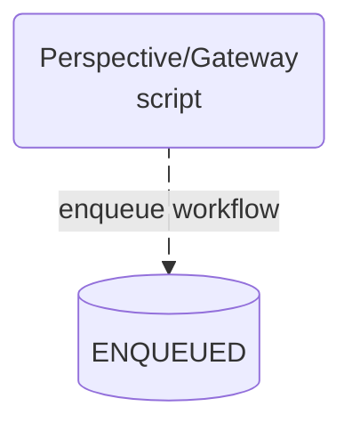
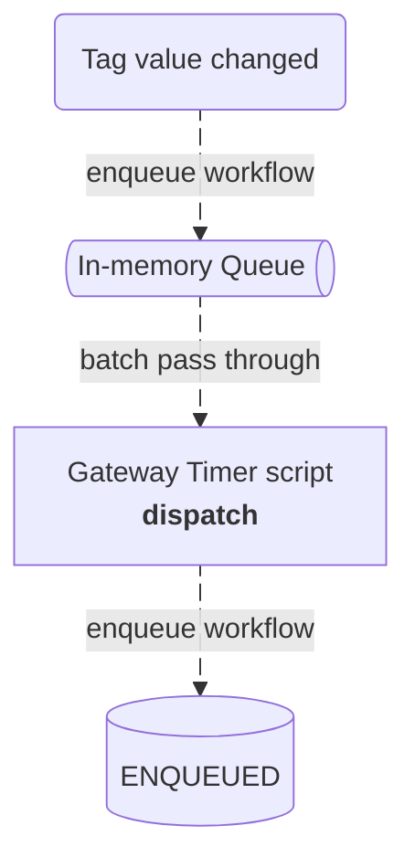
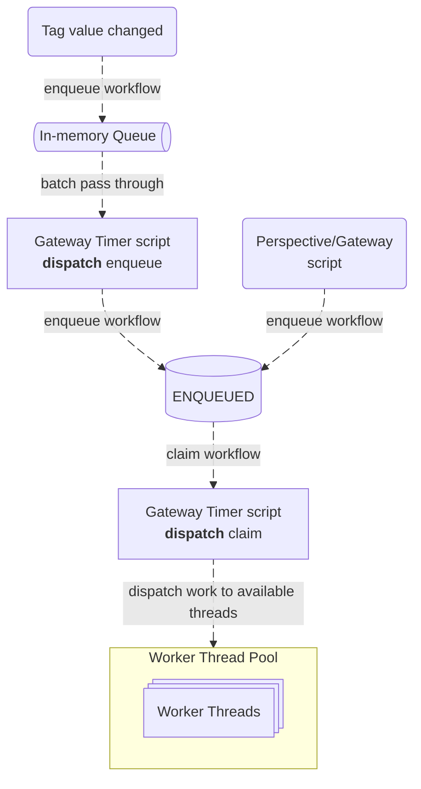
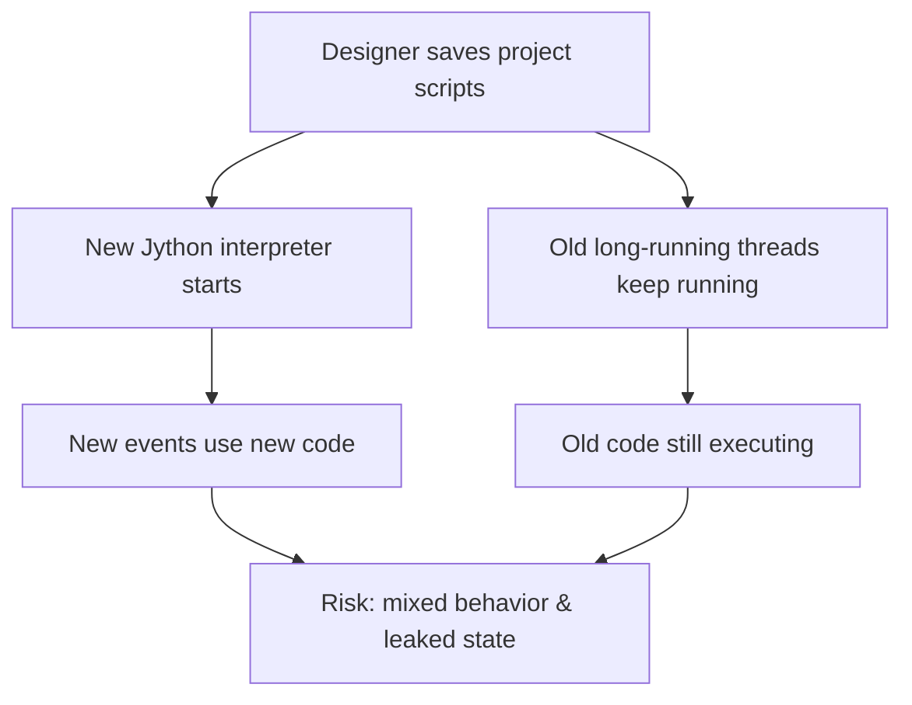
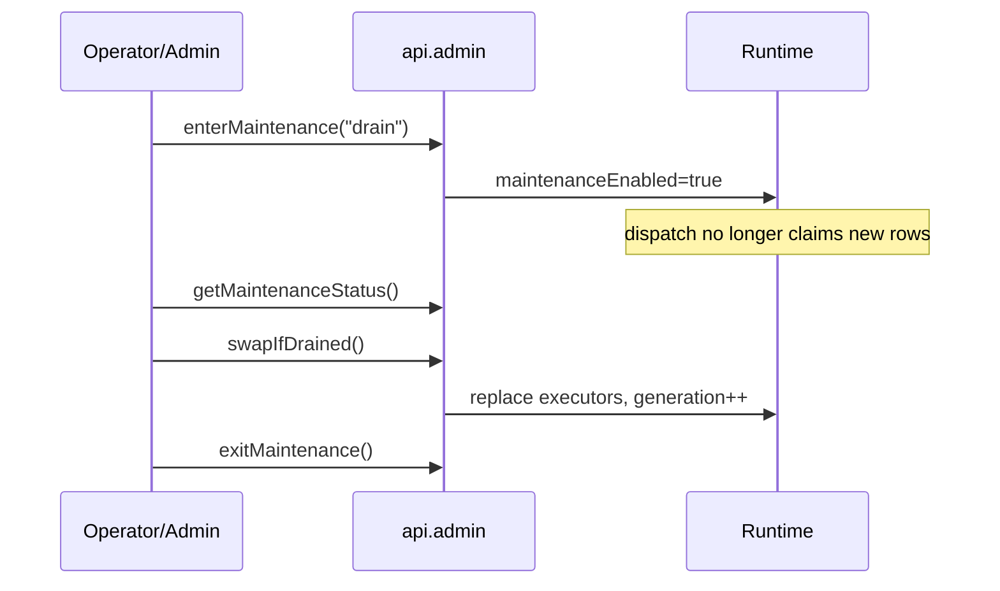

# Architecture

This project implements a DBOS durable workflow engine inside Ignition, using Postgres as the system-of-record and a Gateway timer script dispatcher + worker pools to execute work. The end goal is the same as DBOS:

- You can start long-running workflows from decorated functions
- Work survives restarts and transient failures
- Steps are durable and offer replay
- Operators can observe, control, and intervene (hold/resume/stop, prompts, etc.)

The project also deals with script interpreter reloads (read more here).

---

## Workflow and steps

- **Workflows** are functions that describe a long-running process.
- **Steps** are the units of work inside workflows that the library makes durable.
- When a workflow calls a step, library persists the step result so it can:
- **replay** the result on retry/restart
- avoid re-running the step if it already succeeded
- apply retry/backoff rules in a consistent way

## System database

- workflow rows (status, inputs, timestamps, ownership)
- step outputs / attempts (call sequence, output/error, timing)
- events + streams (for observability)
- notifications/mailbox (send/recv for async coordination)
- deduplication metadata (idempotent enqueue)

The DB is what makes it durable. Executors can crash, processes can restart. Recovery is just “read DB, resume from durable checkpoints.”

## Executors + queues

Library executors repeatedly:

1. **claim** some ENQUEUED workflows from a queue
2. mark them owned by the executor
3. execute them
4. update status + heartbeats
5. write terminal state when done (SUCCESS/ERROR/CANCELLED)

## Workflow Runtime

### Enqueue

(e.i. create durable work)

A workflow request becomes a row in Postgres with status `ENQUEUED`.

This library has two ways to enqueue workflows.

#### Normal enqueue

Use when you can afford a DB write right now.

- API: `exchange.workflows.api.service.start(...)`
- Behavior: inserts a workflow as a `ENQUEUED` row into the database immediately.

#### Fast enqueue for tag events

Use when latency matters (e.g. tag event scripts) waiting on DB I/O.

- API: `exchange.workflows.api.service.enqueueInMemory(...)`
- Behavior: put request into in-memory queue only and tag change will proceed immediatly and not wait/hog the thread.
- DB write happens on the next timer dispatch flush.
- Dispatch will pass through all workflow requests from the memory queue into the DB in a batch insert.

### Dispatch

On every gateway timer execution tje dispatcher is responsible for a few things:

- flush in-memory queue,
- apply capacity limits,
- claim rows,
- enforce maintenance behavior,
- and run work predictably.

### Start execution

(e.i. transition to RUNNING when code actually begins)

When a worker thread picks up a claimed row:

- it transitions `PENDING -> RUNNING`
- it sets `started_at_epoch_ms` at that moment
- it computes `deadline_epoch_ms = started_at + timeout`

### Step execution

Inside the workflow:

- each step call increments a deterministic `call_seq`

  - if ERROR: retry a configurable amount of times
  - else: execute and persist output/error

### Terminal states

When workflow finishes, it writes one terminal status:

- SUCCESS
- ERROR
- CANCELLED

---

### Partition keys

(e.i. arbitration to a shared resource)

one workflow at a time per instrument/resource.

- DB: don’t claim if another workflow in that partition is already pending/running
- runtime: keep a local active partition set to avoid double-dispatch in-process

### Ignition/Jython interpreter reload issue

Ignition adds one special operational hazard DBOS doesn’t have. If you save a project script library in Ignition:

1. A new Jython interpreter is created.
2. Old running threads are not automatically killed.
3. Those old threads keep running old code until they exit.

That can create version-mixing bugs and memory leaks when old interpreter objects stay referenced.

This behavior is not a Workflows-specific issue; it is a known Ignition/Jython lifecycle behavior discussed heavily in the [forum](#references){ data-preview }.

This project is basically built around that reality:

- Keep one workflow runtime per Gateway JVM (not per interpreter).
- Don’t accidentally create new thread pools every time scripts reload.
- Make workflows durable by storing state in Postgres, not in memory.
- Keep tag/event scripts fast (single-digit ms ideally).
- Provide a clean “upgrade / cutover” during production enviroments using maintenance mode.

#### How we mitigate mixed-version execution

We use maintenance controls and generation swap instead of pretending restarts do not happen.

- `enterMaintenance(mode="drain")`: stop claiming new work.
- Let in-flight work finish.
- `swapIfDrained()`: swap executors and increment generation when drained.
- `exitMaintenance()`: resume normal dispatch.

This does not magically preempt running step code (that is a non-goal). It gives you a controlled cutover model.

## Quick glossary

- **Interpreter**: the Jython runtime that holds loaded script code.
- **Kernel**: persistent Java concurrency state used by this workflow engine. (name might change in future)
- **Facade**: the lightweight `WorkflowsRuntime` class.
- **Enqueue**: register a workflow request (either in DB or in memory first).
- **Dispatch**: claim queued rows and submit execution to worker threads.
- **Claim**: atomically mark DB rows so one executor instance owns execution.
- **Generation**: runtime version counter used during maintenance cutovers.

## References

These posts explain the lifecycle/thread behavior this design is built around:

- [When are gateway scripts reloaded?](https://forum.inductiveautomation.com/t/when-are-gateway-scripts-reloaded/14735)
  - project save creates new interpreter; running scripts/threads keep old environment.
- [Request persistence of an object instance after scripting save](https://forum.inductiveautomation.com/t/request-persistence-of-an-object-instance-after-scripting-save/23641)
  - old Jython objects can persist; `invokeAsynchronous` threads can be a major hazard.
- [Gateway Script Error: super(type, obj) ...](https://forum.inductiveautomation.com/t/gateway-script-error-super-type-obj-obj-must-be-an-instance-or-subtype-of-type/51042)
  - clear explanation that save does not kill running threads.
- [Garbage collection for scripts](https://forum.inductiveautomation.com/t/garbage-collection-for-scripts/36627)
  - guidance on long-lived thread shutdown signaling.
- [Tag value change event](https://forum.inductiveautomation.com/t/tag-value-change-event/74998)
  - why tag event scripts should be single-digit milliseconds.
- [Script execution time](https://forum.inductiveautomation.com/t/script-execution-time/98211)
  - deeper details on tag event thread pools and missed events.
- [Managing multiple asynchronous threads](https://forum.inductiveautomation.com/t/managing-multiple-asynchronous-threads/37185)
  - practical discussions around multi-thread script management in Ignition.
