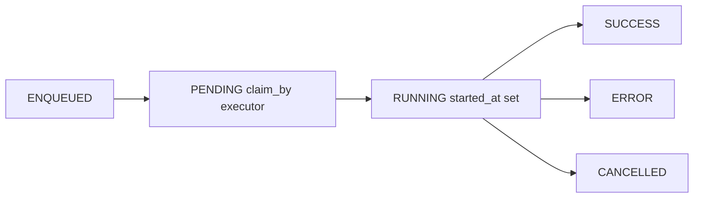
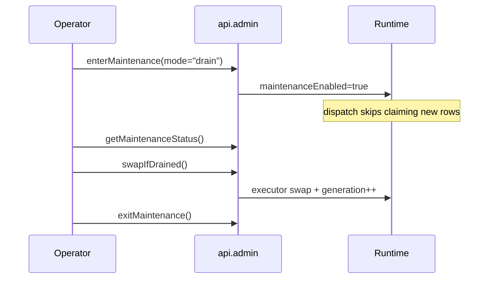

# Concurrency + Lifecycle

If you only read one internals page, make it this one.

This is the practical model for how work actually moves through the runtime.

## What kicks off work

A gateway timer script calls dispatch on every tick:

- timer entrypoint: `ignition/timer/tick/handleTimerEvent.py`
- API call: `exchange.workflows.api.service.dispatch(...)`

That dispatch cycle does three things in order:

1. flush in-memory enqueue items (fast path)
2. claim durable rows from DB
3. submit runnable work to executors

## Queueing modes

You have two enqueue paths:

- `start(...)`: durable insert now
- `enqueueInMemory(...)`: fast ack now, durable insert on next dispatch flush

Use `enqueueInMemory` for bursty tag events where you want to avoid direct DB I/O in that script.

## Claim flow and status transitions

Important details:

- claim uses DB row locking (`SKIP LOCKED`) so workers don’t double-claim
- `started_at` and `deadline` are set when execution starts, not at enqueue time
- if dispatch fails to submit a claimed row, claim is released back to `ENQUEUED`

## Partition key behavior

`partitionKey` is used to serialize work for a shared resource.

If another run with the same partition is already active, new claims for that partition are skipped/released until the active one finishes.

## Thread pools (two of them)

Runtime keeps two executors in the shared kernel:

- workflow executor: runs workflow orchestration
- step executor: runs step work

Why split them?

- better control over orchestration capacity vs step workload
- cleaner diagnostics for queueing pressure and thread usage

## Singleton runtime across script reloads

Ignition script reloads can leave old threads alive. This runtime mitigates that by keeping a Java-only kernel in gateway globals and creating lightweight runtime facades per interpreter session.

That gives you:

- stable shared executor/kernel state
- reduced chance of creating accidental extra pools on save/reload
- explicit maintenance/swap controls for controlled cutovers

## Maintenance modes and cutover

- `drain`: stop claiming new work, let in-flight work finish
- `cancel`: drain + cooperative cancel for queued/running work
- `swapIfDrained`: replace executors and increment generation when safe
- `exitMaintenance`: resume normal dispatch

## Cancellation and timeout model

This runtime is cooperative. There is no hard thread preemption.

What that means for authors:

- call `checkCancelled()` in loops and before long operations
- chunk long waits (`sleep_chunked`) so commands can be honored quickly
- treat retry/idempotency seriously for step side effects

## Quick operator verification checklist

If something feels off, check these first:

1. Is timer dispatch running?
2. Is maintenance mode enabled?
3. Are workflow/step executor active counts pegged?
4. Is in-memory queue depth growing with no flush?
5. Are rows stuck in `ENQUEUED`/`PENDING`?

Useful places:

- `/admin` controls + diagnostics JSON
- `/queues` status counts
- `/runs` and `/runs/:uuid` details/events/streams
- DB tables:
  - `workflows.workflow_status`
  - `workflows.operation_outputs`
  - `workflows.workflow_events`
  - `workflows.streams`
