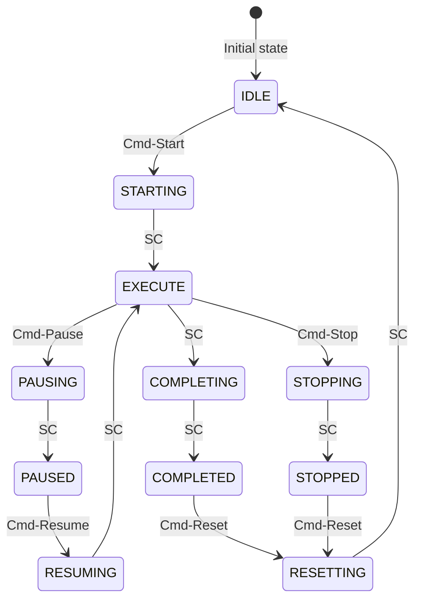
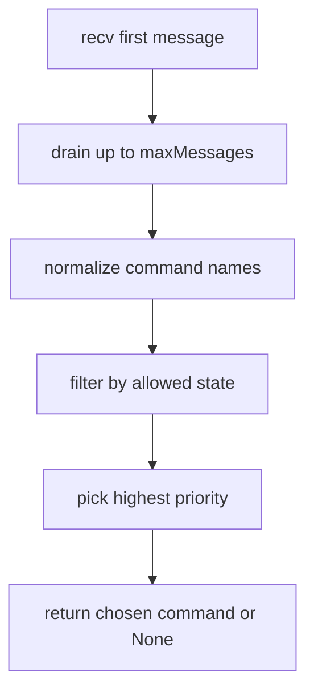

# State Model and Commands

Workflows can (not required) follow a practical ISA-88 model with cooperative commands.
There is some guidance as part of the library and some details can be found below.

## States

- `IDLE`
- `STARTING`
- `RUNNING`
- `HOLDING`
- `HELD`
- `RESUMING`
- `STOPPING`
- `STOPPED`
- `COMPLETE`
- `ERROR`

## Commands

- `HOLD`
- `RESUME`
- `STOP`
- `RESET`

Priority is fixed:

- `STOP > HOLD > RESUME > RESET`

## Allowed command policy

| Command | Allowed states |
|---|---|
| `STOP` | all states |
| `HOLD` | `STARTING`, `RUNNING`, `RESUMING` |
| `RESUME` | `HELD` |
| `RESET` | `STOPPED`, `ERROR` |

## State diagram



## Command arbitration

`recvCommand()` drains a bounded set of mailbox messages and uses `exchange.workflows.is88.models.pickHighestPriority(...)`.



## Workflow example

```python
@workflow(name="demo.commands_60s")
def commands_60s():
    rt = getWorkflows()

    while True:
        rt.checkCancelled()
        cmd_info = rt.recvCommand(currentState="RUNNING", topic="cmd", timeoutSeconds=0.2)

        if cmd_info:
            cmd = str(cmd_info.get("cmd", "")).upper()
            if cmd == "HOLD":
                while True:
                    rt.checkCancelled()
                    held_cmd = rt.recvCommand(currentState="HELD", topic="cmd", timeoutSeconds=0.2)
                    if held_cmd and str(held_cmd.get("cmd", "")).upper() == "RESUME":
                        break
            elif cmd == "STOP":
                raise Exception("Stopped by operator")

        sleep_chunked(total_ms=500, chunk_ms=250)
```

