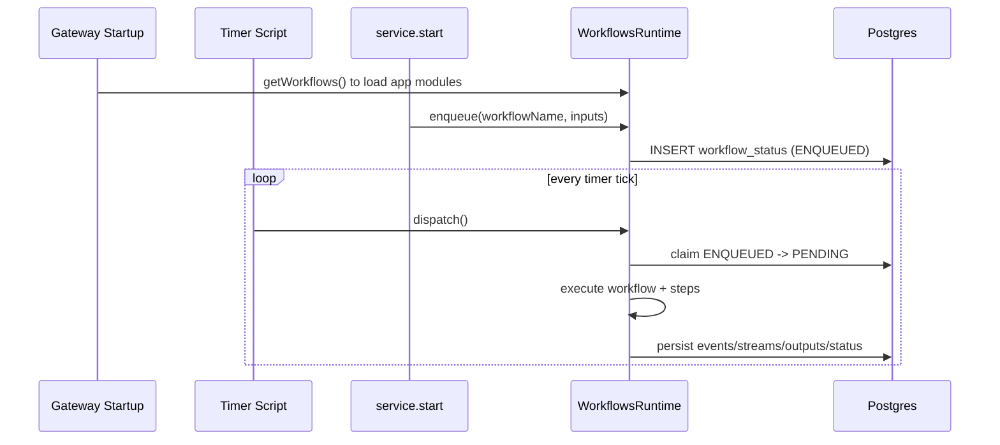

# Getting Started

## Prerequisites

- Ignition Gateway project imported (`projects/workflows`).
- Postgres reachable from Ignition.
- Ignition DB connection named `WorkflowsDB` (default).
- Gateway timer script enabled at `ignition/timer/tick`.

## 1) Create schema

### Option A: Named query

Run:

- `Exchange/Workflows/Schemas/Create`

### Option B: Admin UI

Go to `/admin`, then use **Backend Control / Test** actions.

## 2) Start one workflow

```python
resp = exchange.workflows.api.service.start(
    workflowName="demo.commands_60s",
    inputs={"resolved": {"paramOne": "hello"}},
    queueName="default",
    priority=0,
)
print resp
```

The run id is at `resp["data"]["workflowId"]`.

## 3) Send command controls

```python
wid = resp["data"]["workflowId"]
print exchange.workflows.api.service.sendCommand(workflowId=wid, cmd="HOLD", reason="operator hold")
print exchange.workflows.api.service.sendCommand(workflowId=wid, cmd="RESUME")
print exchange.workflows.api.service.sendCommand(workflowId=wid, cmd="STOP", reason="stop requested")
```

## 4) Watch it in UI

- `/runs` for list + filtering.
- `/runs/<uuid>` for details + events + command buttons.
- `/runs/<uuid>/steps` for step timeline and output details.
- `/queues` for queue status.

See [UI Walkthrough](../ui/workflows-console.md) for screenshots and tips.

## Runtime flow (high level)



If you want the deeper threading/claim lifecycle, read [Concurrency + Lifecycle](../concepts/concurrency-lifecycle.md).
