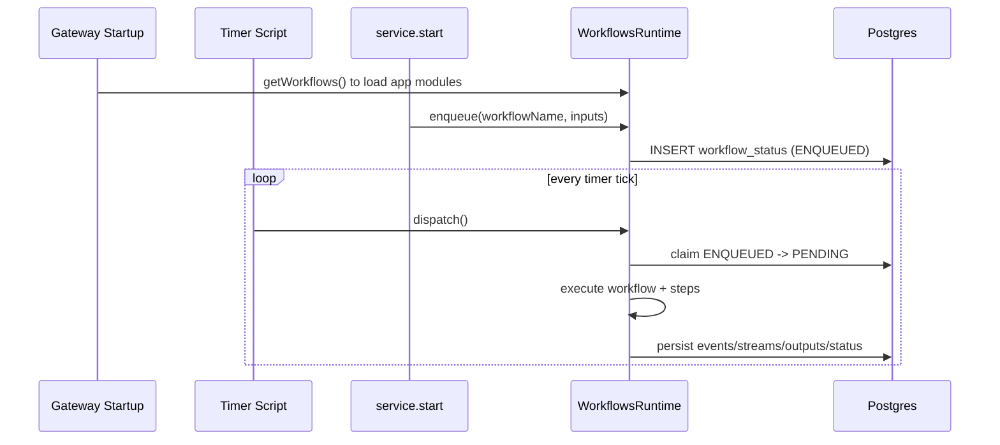

# Getting Started

This is the fastest path to get workflows running.

## Prerequisites

- Ignition Gateway project imported (`projects/workflows`).
- Postgres reachable from Ignition.
- Ignition DB connection named `WorkflowsDB` (default).
- Gateway timer script enabled at `ignition/timer/tick`.

## Create schema

### Use named query

- `Exchange/Workflows/Schemas/Create`

### Or use the admin screen

- location

## Start a workflow

```python
resp = exchange.workflows.api.service.start(
    workflowName="demo.commands_60s",
    inputs={"resolved": {"paramOne": "hello"}},
    queueName="default",
    priority=0,
)
print resp
```

The workflow id is `resp["data"]["workflowId"]`.

### Send commands to a run

```python
wid = resp["data"]["workflowId"]
print exchange.workflows.api.service.sendCommand(workflowId=wid, cmd="HOLD", reason="operator hold")
print exchange.workflows.api.service.sendCommand(workflowId=wid, cmd="RESUME")
print exchange.workflows.api.service.sendCommand(workflowId=wid, cmd="STOP", reason="stop requested")
```

## Example Sequence Diagram


