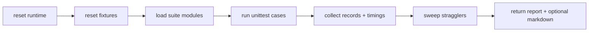

# Testing

This project ships an Ignition-native unittest suite and report formatters.

## Entrypoint

Main runner:

- `exchange.workflows.tests.runner.run_all(...)`

Markdown helper:

- `exchange.workflows.tests.runner.run_all_md(...)`

## Run from Script Console

```python
report = exchange.workflows.tests.runner.run_all(dbName="WorkflowsDB", profile="smoke")
print report

md = exchange.workflows.tests.runner.run_all_md(dbName="WorkflowsDB", profile="full")
print md["markdown"]
```

Profiles:

- `smoke`
- `full`

Suites include core/api/commands/maintenance/dispatch/runtime/steps/concurrency/db_contract/retention.

## Report shape

```python
{
  "ok": True,
  "summary": {
    "passed": 0,
    "failed": 0,
    "errors": 0,
    "skipped": 0,
    "total": 0,
    "sweptStragglers": 0,
  },
  "suites": [...],
  "cases": [...]
}
```

## Test execution flow


