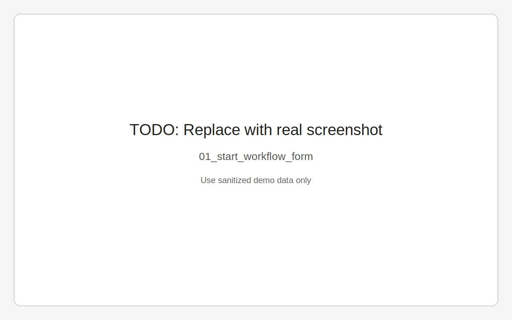
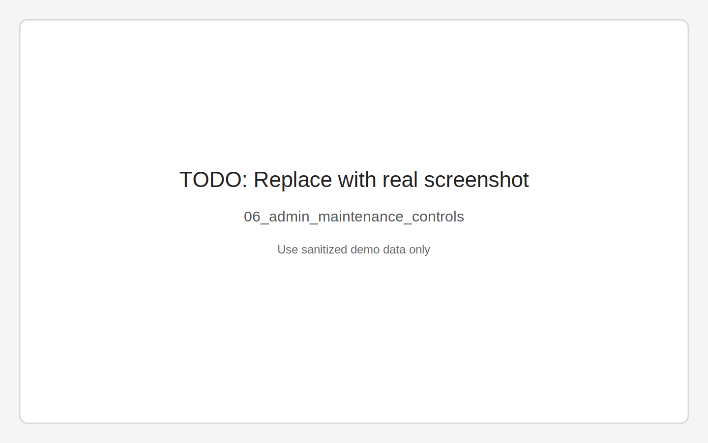

# Workflows Console UI Walkthrough

This page walks through the main Perspective routes for operators.

## Navigation map

- `/` -> Start workflow form
- `/runs` -> Runs monitor
- `/runs/:uuid` -> Run details + controls
- `/runs/:uuid/steps` -> Step timeline and output table
- `/queues` -> Queue/status overview
- `/admin` -> Maintenance + retention + diagnostics

## 1) Start workflow (`/`)

Pick a workflow, fill demo values, and start a run.

- Screenshot: `01_start_workflow_form.svg` (placeholder file currently)
- What to look for: selected workflow/template + enabled start button

_Placeholder image: replace with a sanitized screenshot from `/`._

## 2) Monitor runs (`/runs`)

Filter by name/status/time range and open a specific run.

- Screenshot: `02_runs_monitor_filters.svg` (placeholder file currently)
- What to look for: list updates with filters and selected row UUID

_Placeholder image: replace with a sanitized screenshot from `/runs`._

## 3) Run details (`/runs/:uuid`)

Use this page for command controls and payload inspection.

- Screenshot: `03_workflow_details_commands.svg` (placeholder file currently)
- What to look for: status badge, `Hold/Resume/Reset/Cancel`, event + JSON panels

_Placeholder image: replace with a sanitized screenshot from `/runs/:uuid`._

## 4) Steps timeline (`/runs/:uuid/steps`)

Use this to see step order, timing, and output/error rows.

- Screenshot: `04_workflow_steps_timeline.svg` (placeholder file currently)
- What to look for: tree/timeline and step output table linked to same run UUID

_Placeholder image: replace with a sanitized screenshot from `/runs/:uuid/steps`._

## 5) Queue health (`/queues`)

Quick status count view by queue and workflow status.

- Screenshot: `05_queue_status_counts.svg` (placeholder file currently)
- What to look for: per-queue counts across `ENQUEUED/PENDING/RUNNING/SUCCESS/ERROR/CANCELLED`

_Placeholder image: replace with a sanitized screenshot from `/queues`._

## 6) Admin controls (`/admin`)

Main admin view for maintenance operations and retention settings.

- Screenshot: `06_admin_maintenance_controls.svg` (placeholder file currently)
- What to look for: Drain/Cancel/Swap/Resume controls and retention policy tab

_Placeholder image: replace with a sanitized screenshot from `/admin`._

## Notes on screenshot placeholders

Real screenshots are intentionally not auto-captured in this environment.

Use the tracked shot list here:

- [Screenshot Shot List](screenshot-shot-list.md)

That page includes the exact navigation steps, expected state, demo data, and target filenames.
