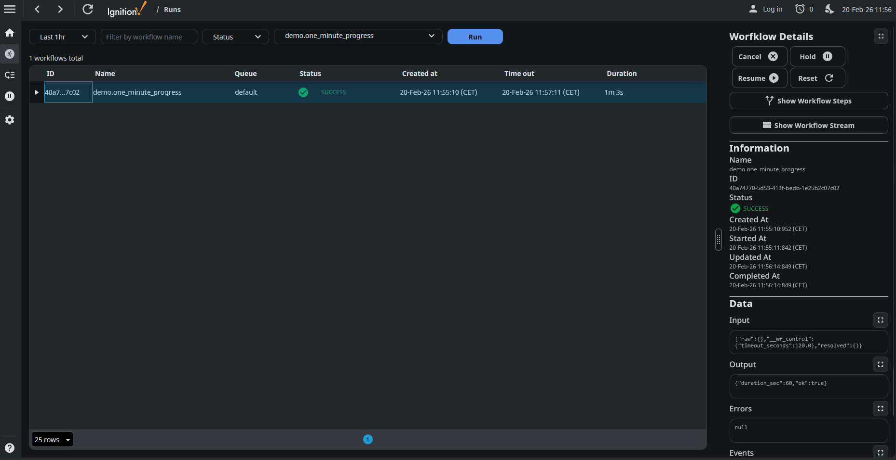
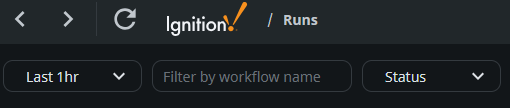
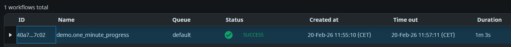
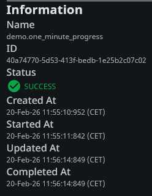
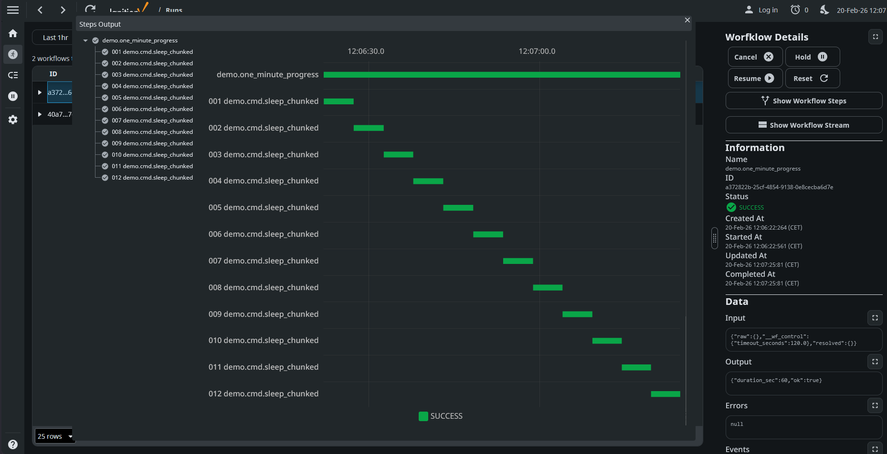
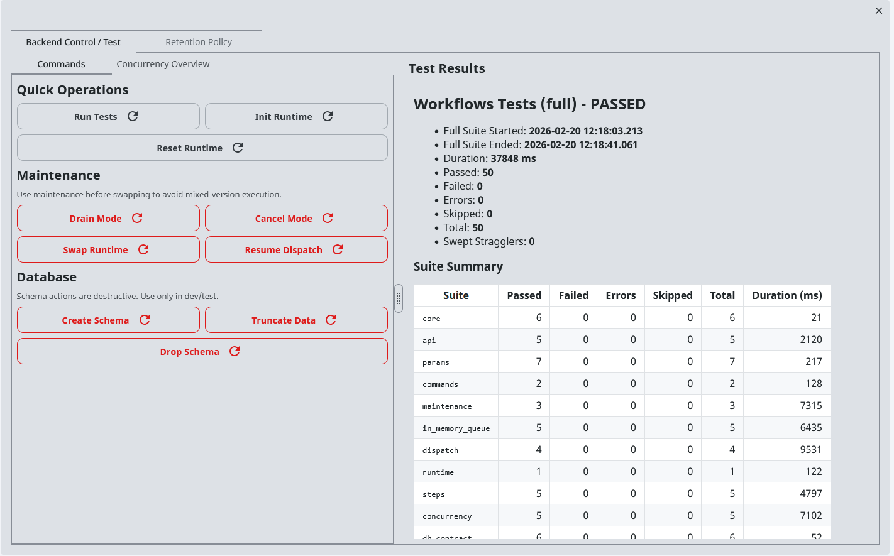
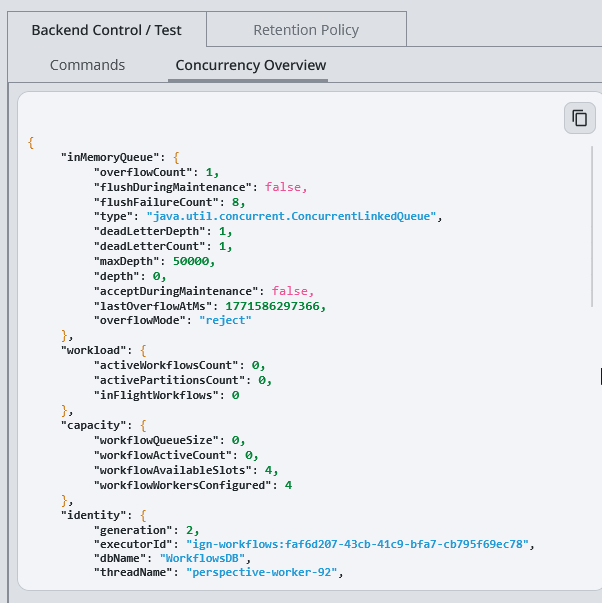
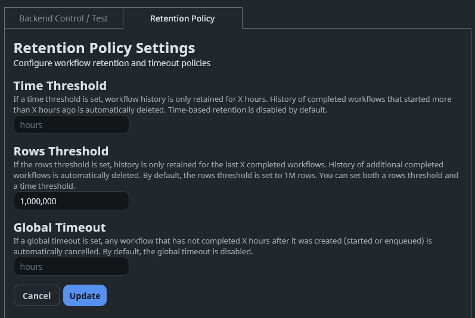

# Workflows Console UI Walkthrough

## Navigation map

- `/` -> Start workflow form
- `/runs` -> Runs monitor
- `/runs/:uuid` -> Run details + controls
- `/runs/:uuid/steps` -> Step timeline and output table
- `/queues` -> Queue/status overview
- `/admin` -> Maintenance + retention + diagnostics

## Start workflow (`/`)

Pick a workflow, fill demo values, and start a run.

## Monitor runs (`/runs`)

Filter by name/status/time range and open a specific run.

### Components

- Filter by hour, workflow name or status
 

- Workflows status, id, name, queue, status, created/timeout datetime and duration
 

- Selected workflows information, id, name, queue, status, created/timeout datetime and duration

 

## Steps timeline (`/runs/:uuid/steps`)

Use this to see step order, timing, and output/error rows.

- Step tree/timeline and step output table linked to same run UUID

## Admin controls (`/admin`)

Main admin view for maintenance operations and retention settings.

- Drain/Cancel/Swap/Resume controls

- Concurrency overview status

- Retention policy tab

